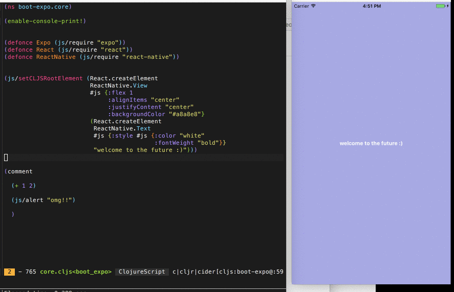

# boot-expo

Minimal project that uses [Boot](http://boot-clj.com) to
compile [ClojureScript](https://clojurescript.org) to run
on [Expo](https://expo.io).

Uses [`boot-cljs`](https://github.com/boot-clj/boot-cljs) to compile
ClojureScript, [`boot-reload`](https://github.com/adzerk-oss/boot-reload) to
recompile and load sources without restarting the app,
and [`boot-cljs-repl`](https://github.com/adzerk-oss/boot-cljs-repl) to provide
a read-eval-print loop into the running instance of the app.

I highly recommend the first 3 sections of
the [Modern ClojureScript tutorial](https://github.com/magomimmo/modern-cljs) to
learn about using Boot with these tasks for ClojureScript for the web. The
`boot.build` file for this Expo project is essentially the same as that for a
web ClojureScript project.

## Files

- `main.js` is the JavaScript entrypoint of the Expo application. Sets up remote
  loading of JavaScript files for the Google Closure Library (used by
  ClojureScript to load compiled JavaScript sources) to call into, maps module
  names for `(js/require ...)` to work in ClojureScript and initializes a root
  React component that waits for a root component from ClojureScript. This file
  contains all the magic, the rest of the project is like a normal Expo app or a
  normal ClojureScript web app.
- `src/cljs/boot_expo/core.cljs` contains a minimal ClojureScript React Native
  app that uses React Native directly without any wrappers.
- `target/` is where all of the ClojureScript build output will go.
  `target/main.js` will be the entrypoint of the ClojureScript compiled part of
  the app.
- `build.boot` is the Boot file containing build tasks. The `dev` task starts a
  development environment with reloading and a REPL.
  
## Running in development mode

Make sure you are already ready to run normal JavaScript Expo projects by
following [Expo's Up and Running guide](https://docs.expo.io/versions/latest/guides/up-and-running.html).

Then make sure you
have [Boot installed](https://github.com/boot-clj/boot#install).

Run `boot dev` at the root of this project to start the ClojureScript
compilation process and the REPL server. After it's ready, you can load your
project normally with Expo (using XDE or `exp`).

To connect to the REPL, connect to the nREPL server indicated by the output of
`boot dev`. This can be done using `boot repl -c` in another terminal, or from
an editor such as Cursive, CIDER on Emacs, etc. In the resulting Clojure
REPL,
[run `(start-repl)` to enter the ClojureScript REPL](https://github.com/adzerk-oss/boot-cljs-repl#repl).
Then you're ready to go!
